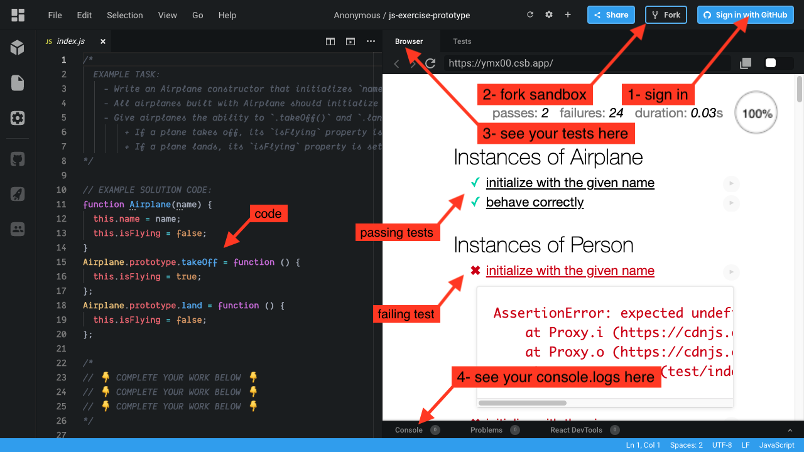

# Constructors, Prototypes and _this_

## JavaScript Fundamentals

## Objectives

- explain the four principles of the 'this' keyword and demonstrate each explanation with an example of their uses
- describe, and use prototypes, constructor functions the new keyword, and pseudo-classical inheritance to build objects

## Introduction

In order to complete these tasks you will need your newly aquired knowledge of constructor functions, prototypes, and the `this` keyword.

## Instructions

### Task 1 - Set up Project

Two options are included below.

  
1. Using Code Sandbox

  * Launch the sandbox using the link below.
  * Sign into Code Sandbox.
  * Fork the sandbox.
  * See your tests running on the "Browser" tab (NOT the "Tests" tab).
  * The way you'll submit your work will be by pasting a link to your fork into the submission form.

  [LAUNCH ON CODESANDBOX 🚀](https://codesandbox.io/s/github/LambdaSchool/JS-Exercise-Prototype?previewwindow=browser)

  

  
2. Using VSCode and the Command Line

  1. Fork repo and add TL as collaborator on Github.
  1. Clone _your_ fork (not Lambda's repo by mistake!).
  1. `cd` into your newly cloned repository.
  1. Create a new branch by typing `git checkout -b <firstName-lastName>`.
  1. Install dependencies by typing `npm install`.
  1. Run tests by typing `npm run test:watch`.
  1. Work on your branch, push commits and create PR as usual.
  1. Make sure to commit often!!

  

### Task 2a - MVP

Find the file `index.js` and complete tasks 1, 2 and 3 until all of your tests pass.
There is an additional task 4 which requires written explanations and has no tests.

If you run into trouble while coding, fight the good fight for 20 minutes and then get on the help channel. __Remember to formulate your help request in a professional manner__ - like you would at the job - by including error messages, screenshots, and any other pertinent information about the problem, as well as what things you have attempted already while trying to solve it.

### Task 2b - Exit Ticket

Once you begin, you will have 15 minutes to answer the questions [here](https://app.codesignal.com/public-test/bvaz9NW52Asuc8DGZ/LK7SEZ9FcLpjgj).

The completion of these questions is mandatory for MVP. However, passing the quiz doesn't affect your standing as a Lambda School student whatsoever. This is Lambda School testing itself! Please answer honestly and to the best of your ability without using external references.

### Task 3 - Stretch 

There are stretch goals found throughout `index.js`. Do not start work on these until you have finished MVP. 

## Submission format

Follow these steps for completing your project.

- [ ] Submit a Pull-Request to merge <firstName-lastName> Branch into master (student's  Repo). **Please don't merge your own pull request**
- [ ] Add your team lead as a reviewer on the pull-request
- [ ] Your team lead will count the project as complete by merging the branch back into master.
